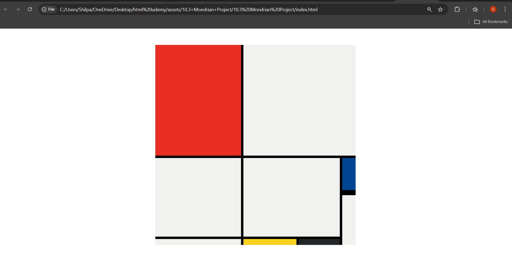

# Mondrian Layout Project

This project recreates a Piet Mondrian inspired layout using **HTML and CSS Grid**.

The design uses colored blocks separated by thick black lines, similar to the famous abstract artworks by Dutch painter Piet Mondrian.

## Technologies Used

- HTML5
- CSS Grid
- CSS Styling

## Features

- Grid based layout
- Accurate positioning using CSS Grid
- Clean and simple HTML structure
- Use of colors inspired by Mondrian paintings

## Project Preview



## How to Run the Project

1. Download or clone the repository
2. Open the folder
3. Open `index.html` in your browser

The webpage will display the Mondrian layout.

## Project Structure

```
mondrian-layout
│
├── index.html
├── dimensions.png
├── goal.png
└── README.md
```

## Learning Outcome

This project helped practice:

- CSS Grid layout
- Positioning elements
- Creating structured layouts
- Working with grid rows and columns
